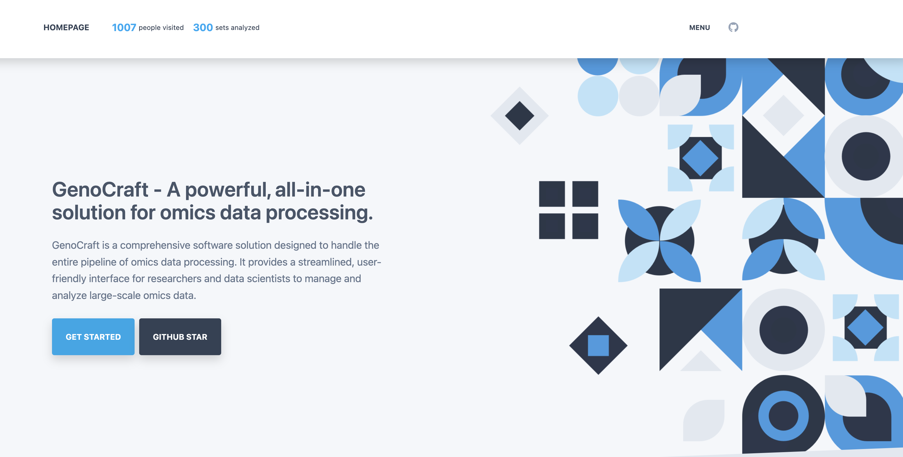
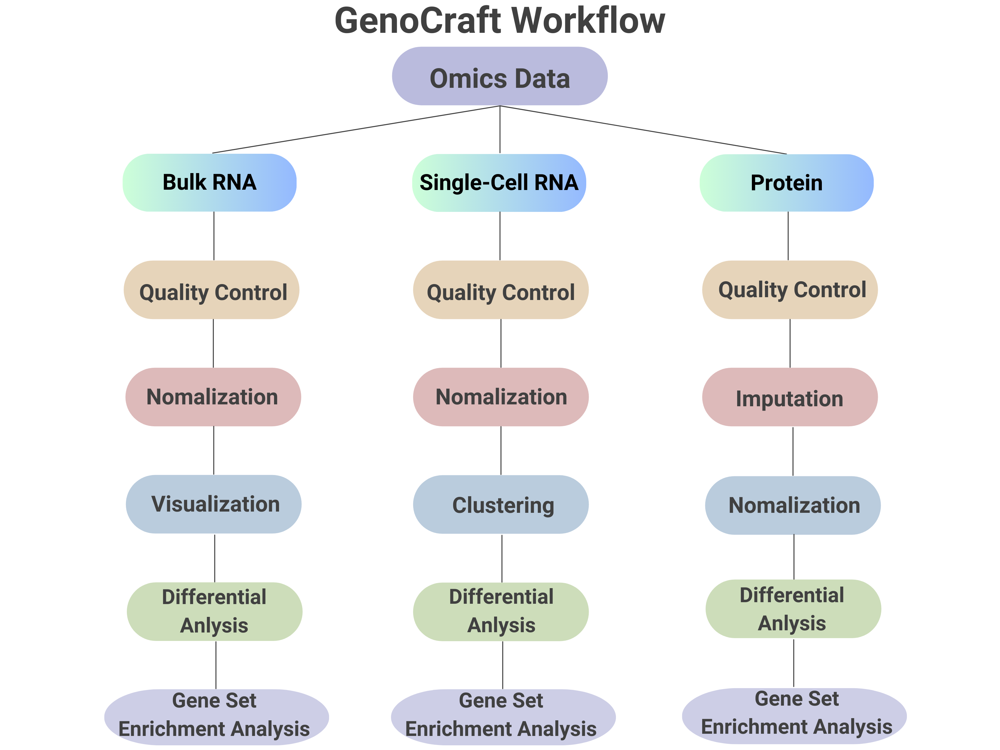

# 🧬 GenoCraft: A Comprehensive Web-Based Platform for Omics Data Analysis and Visualization 📊


The [video](https://www.youtube.com/) illustrates how to use GenoCraft with an interactive environment. 




🔬 **GenoCraft** GenoCraft is an all-inclusive software solution designed to streamline the complex process of omics data analysis. The software encapsulates the entire pipeline, providing an intuitive interface for researchers and data scientists to effectively handle large-scale omics data.

The process begins with data normalization and quality control, ensuring data reliability. Advanced algorithms like T-SNE are then used for data visualization and pattern recognition. Clustering techniques group similar data points together, revealing key trends. Differential analysis allows for the comparison of different data sets, identifying unique patterns and anomalies. The final step is pathway analysis, which provides a deeper understanding of the underlying biological processes.

In summary, GenoCraft is a powerful, all-in-one solution for omics data processing, providing researchers with the tools they need to transform raw data into meaningful insights.




## 🌟 Features
- 🔎 **Data Normalization and Quality Control**: GenoCraft ensures data reliability and robustness from the outset.
- 📈 **Data Visualization and Pattern Recognition**: Advanced algorithms like T-SNE are utilized for effective visualization and pattern identification.
- 📊 **Clustering**: Efficient clustering techniques help group similar data points together, revealing key trends.
- 📉 **Differential Analysis**: The software enables the comparison of different data sets, aiding in the identification of unique patterns and anomalies.
- 📚 **Pathway Analysis**: This final step of the process provides in-depth insights into the underlying biological processes.

🧪 **GenoCraft** is designed to transform raw data into meaningful insights, empowering researchers to unlock the true potential of their omics data.


## 📁 Repo Structure 
This repository contains three main folders: 

- `single_cell`
- `bulk_RNA`
- `protein`

## 🚀 Installation 
To install the necessary dependencies, run the following commands:

```bash
pip install numpy scipy matplotlib tqdm scikit-learn networkx statsmodels seaborn pyyaml==4.2b1 HTSeq 
```

## 💻 Usage

### 🧪 Bulk RNA Analysis

GenoCraft offers several analysis steps for Bulk RNA data:

1. **Normalization**: Adjusts raw gene expression measurements for systematic technical differences.
2. **Differential Analysis**: Identifies genes with statistically significant changes in expression levels between different conditions.
3. **Network Analysis**: Constructs and analyzes gene networks to identify key genes and pathways.
4. **Gene Set Enrichment Analysis/pathway enrichment**: Identifies biological pathways associated with differentially expressed genes.
5. **Visualization**: Offers various visualization tools for better interpretation of the results.


### 🔬 Single Cell RNA Analysis

For Single Cell data, GenoCraft provides these analysis steps:

1. **Normalization**: Standardizes and scales the data.
2. **Quality Control**: Ensures data is accurate, consistent, and reliable.
3. **T-SNE Visualization**: Visualizes high-dimensional data in a low-dimensional space.
4. **Clustering**: Groups similar data points together.
5. **Differential Analysis**: Identifies genes with statistically significant changes in expression levels between different conditions.
6. **Pathway Analysis**: Identifies the pathways significantly impacted in a condition under study.


### 🧫 Protein Analysis

1. **Quality Control**: Ensures the accuracy and reliability of protein data.
2. **Missing Data Imputation**: Fills in gaps in the dataset for a more complete analysis.
3. **Normalization**: Adjusts raw gene expression measurements for systematic technical differences.
4. **Differential Analysis**: Identifies proteins with statistically significant changes in expression levels between different conditions.
5. **Network Analysis**: Constructs and analyzes protein networks to identify key proteins and pathways.
6. **Gene Set Enrichment Analysis/Pathway Enrichment**: Identifies biological pathways associated with differentially expressed proteins.
7. **Visualization**: Offers various visualization tools for better interpretation of the results.


## 🤝 Contributing
If you wish to contribute, please refer to the [CONTRIBUTING.md](CONTRIBUTING.md) file. We welcome pull requests for bug fixes, feature requests, and improvements to our code.

## 📜 License
This project is licensed under the terms of the [MIT License](LICENSE).

## 💼 Support
If you need help with the tool, you can raise an issue on our GitHub issue tracker. For other questions, please contact our team.

*Please note: GenoCraft is under active development and certain functionalities are yet to be fully implemented.*
